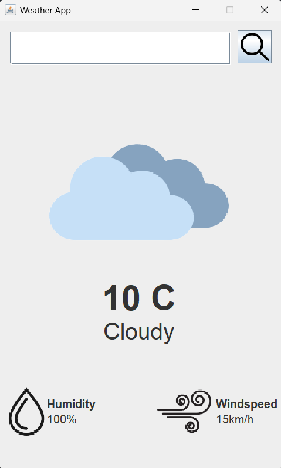
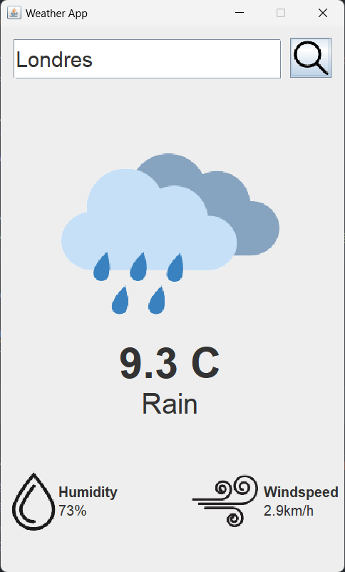

<h1>Weather App</h1>

Um projeto copiado de um youtuber gringo que ensina a criar uma aplicação de clima em Java.

<h2>Como fica o projeto:</h2>

    
    

<h2>Intenção do projeto</h2>

Apender a usar Javax*swing e consumo de API em java

<h2>Creditos:</h2>

Repositorio do github do youtuber: https://github.com/curadProgrammer/WeatherAppGUI-Java

Link do vídeo: https://www.youtube.com/watch?v=8ZcEYv2ezWc&list=WL&index=30

